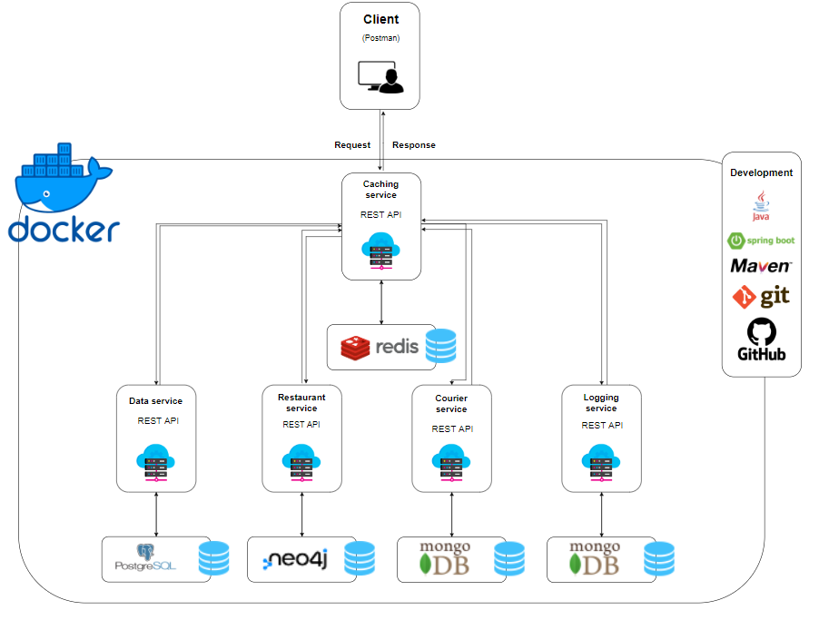

# DBD Exam Project, Cphbusiness SOFT Spring 2022 

This is an exam project for the Databases course on CPH Business for the software developer bachelor degree.
  
## Authors and Group Members

- Allan Bo Simonsen, cph-as484
- Jean-Poul Leth-Møller, cph-jl360
- Nina Lisakowski, cph-nl163
- Magdalena Wawrzak cph-mw216
  
## Introduction
 
An explanation about our system development process can be found below:

[Video link: ](URL MANGLER)  
  
## About The Project  
Documentation for planning and use cases with diagrams can be found here:  
[Planning and use cases](https://github.com/Jean-Poul/DBD-Exam-Project/blob/developer/Text/Planning%20and%20Use%20Cases.pdf)   
  
Documentation for our functional requirements can be found here:  
[Functional requirements](https://github.com/Jean-Poul/DBD-Exam-Project/blob/developer/Text/Functional%20requirements.pdf)  
    
### Microservice architecture  
The following is our architectural solution for the end product:  



### Built With 
#### Databases:  
* MongoDB  
* Neo4j  
* PostgreSQL - [ER-diagram](https://github.com/Jean-Poul/DBD-Exam-Project/blob/developer/Drawings/ER-diagram.png)  
* Redis  

#### Data sources: 
* [Address data: ](https://api.dataforsyningen.dk/adresser?struktur=mini&kommunekode=0159)
* [Menu data: ](https://mealme.p.rapidapi.com/restaurants/details/menu)
* [Restaurants data: ](https://www.kaggle.com/datasets/shrutimehta/zomato-restaurants-data)
* [User data: ](https://www.mockaroo.com/)  
* [Zipcodes data: ](https://github.com/danielbahl/DK-Postnumre/blob/master/postnumre.sql)  
      
#### Development:  
* Git  
* Java   
* Maven   
* Spring Boot 
  
#### System management:  
* Extreme programming  
* Scrum  
* Trello  
     
### Getting Started  
INSERT TEXT ABOUT START
     
### Documentation  
To be able to test our endpoints use the following link to view the documentation for our endpoints.  
[Postman collection documentation](https://documenter.getpostman.com/view/12822718/Uz5DqxXk#9267027e-6b0b-4f3b-b280-a0a9e8865af3)  
  
We have also attached our Postman collection which can be found here:  
[Postman collection](https://github.com/Jean-Poul/DBD-Exam-Project/tree/developer/Postman%20Collection)  
 
### Executing program

* How to run the program
* Step-by-step bullets

```shell
INSERT docker compose command here!
```  

## Version History

* 0.2
    * Various bug fixes and optimizations
    * See [developer branch commits](https://github.com/Jean-Poul/DBD-Exam-Project/commits/developer)
* 0.1
    * Initial Release